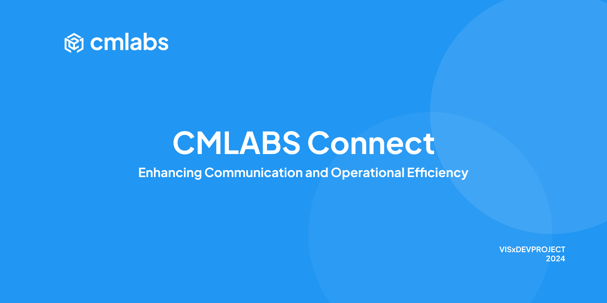

# CMLABS Connect App



CMLABS Connect is a Flutter-based application designed to streamline communication and enhance productivity for users. This repository contains the source code, setup instructions, and documentation for development.

This application can accommodate marketing needs in tracking quotations / leads that enter cmlabs. All incoming leads can be seen and tracked easily in the mobile application.

### Goals
Tracking leads masuk dari berbagai channel yang dimiliki oleh cmlabs.co

## Getting Started

### Prerequisites

- Flutter SDK: Version 3.5.0 or higher
- Dart: Version 3.5.0 or higher
- JDK: Version 11 (Ensure JAVA_HOME is set to JDK 11)
- Android Studio / Xcode: For Android/iOS Development
- Firebase Project: For analytics, messaging, and core services

### Installation

#### Clone the Repository

- Clone project from repository

  ```bash
  git clone https://github.com/sequence-project/cmlabs-connect-app.git
  ```

- Open project directory

  ```bash
  cd cmlabs-connect-app
  ```

#### Install Dependencies

- In terminal type this command

  ```bash
  flutter pub get
  ```

#### Set up Configuration

- The configuration file is located at `/lib/src/constant/config.dart`

  ```
  lib/
  |- src/
      |- constant/
          |- config.dart  # Application configuration
  ```

- The current configuration includes:

  ```dart
  class Config {
    static const String baseURL = 'https://your-API-here.com';
  }
  ```

- Update the `baseURL` if you need to point to a different API server.

#### Firebase Setup

- Ensure you have `firebase_options.dart` configured for your Firebase project
- Place `google-services.json` in the `android/app/` directory for Android
- Place `GoogleService-Info.plist` in the `ios/Runner/` directory for iOS

#### Run the Application

- Open your Emulator (virtual/real device)
- Run the project app
```bash
flutter run
```

#### More Information

A few resources to get you started if this is your Flutter project:

- [Lab: Write your first Flutter app](https://docs.flutter.dev/get-started/codelab)
- [Cookbook: Useful Flutter samples](https://docs.flutter.dev/cookbook)

For help getting started with Flutter development, view the
[online documentation](https://docs.flutter.dev/), which offers tutorials,
samples, guidance on mobile development, and a full API reference.

## Features

The CMLABS Connect app includes the following main features:

- **Dashboard**: Overview of leads and quotations
- **Analytics**: Traffic analysis, trends, top services, and performance metrics
- **Inbox Management**: Handle quotations, contact us forms, case studies, and FAQs
- **Lead Tracking**: Historical lead management and filtering
- **Account Management**: User profiles, achievements, certifications, education, and experience
- **Notifications**: Real-time push notifications and local alerts
- **Authentication**: Secure login and password management

## Deployment

### Android

1. Build APK:

   - Debugging

   ```bash
   flutter build apk --debug
   ```

   - Release

   ```bash
   flutter build apk --release
   ```

2. The APK will be available at `build/app/outputs/flutter-apk/app-release.apk`.

### iOS

1. Open the iOS folder in Xcode:

```bash
open ios/Runner.xcworkspace
```

2. Configure signing and build for release.

## Key Components

### State Management

- **GetX** (^4.6.6): Used for efficient state management, routing, and dependency injection.

### Local Storage

- **flutter_secure_storage** (^9.2.4): Provides secure storage for sensitive data.

### Networking

- **DIO** (^5.7.0): Ensures robust API communication with error handling and interceptors.

### Firebase Services

- **firebase_core** (^3.8.1): Firebase integration setup.
- **firebase_messaging** (^15.1.6): Real-time push notifications.
- **firebase_analytics** (^11.4.6): App analytics and user behavior tracking.

### Notifications

- **flutter_local_notifications** (^18.0.1): Manage local notifications.

### UI & Charts

- **syncfusion_flutter_charts** (^29.1.39): Advanced charting capabilities for analytics.
- **cached_network_image** (^3.4.1): Efficient image loading and caching.
- **calendar_date_picker2** (^1.1.7): Enhanced date picker widgets.

### Essential Packages

The following packages are integral to the functionality and design of the application:

- **screenshot** (^3.0.0): Capture and save screenshots.
- **image_gallery_saver_plus** (^4.0.1): Save images to device gallery.
- **file_picker** (^10.1.9): File selection from device storage.
- **image_picker** (^1.1.2): Camera and gallery image selection.
- **image_cropper** (^9.1.0): Image cropping functionality.
- **flutter_slidable** (^4.0.0): Swipeable list items.
- **flutter_sticky_header** (^0.7.0): Sticky headers for lists.
- **intl** (^0.19.0): Internationalization and date formatting.
- **timeago** (^3.7.0): Human-readable time differences.
- **url_launcher** (^6.3.1): Launch URLs and external applications.
- **permission_handler** (^11.4.0): Handle device permissions.
- **device_info_plus** (^11.3.0): Access device information.
- **pull_to_refresh_new** (^2.0.5): Pull-to-refresh functionality.
- **loading_animation_widget** (^1.3.0): Loading animations.
- **fluttertoast** (^8.2.12): Toast notifications.
- **ionicons** (^0.2.2): iOS-style icons.
- **double_tap_to_exit** (^1.0.2): Double tap to exit confirmation.
- **open_filex** (^4.7.0): Open files with external applications.
- **path_provider** (^2.1.5): Access device file system paths.
- **safe_password_generator** (^1.0.0): Generate secure passwords.

### Development Tools

- **flutter_launcher_icons** (^0.14.1): Simplify app icon customization.
- **flutter_native_splash** (^2.4.3): Configurable splash screens.

## CMLABS Connect - Master Design

- [Design CMLABS Connect](https://www.figma.com/design/4NGJ0J8Rm6UlBmlV2H6OZm/cmlabs-Connect?node-id=1-1635&t=jJ8bTBphXsr2EKhF-1)
